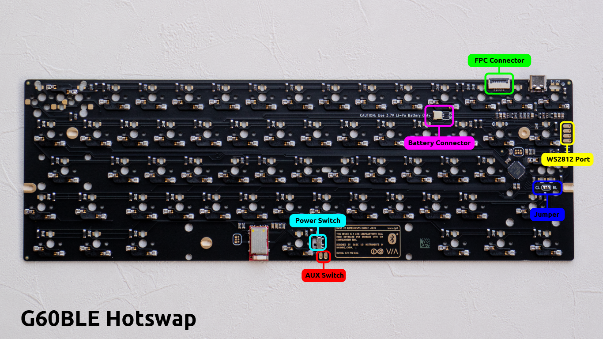

# Basic I/O Instruments G60BLE PCB Guide

## Introduction
Welcome to the G60BLE PCB, this PCB is originally designed for G60 Custom Keyboard, with Bluetooth and USB mode enabled. Powered by QMK and VIA configurator, all the keypress of this board is fully customizable. You can make your own keyboard with any layout that you like.

## Hardware
### Overview
There are two main versions of G60BLE PCB, the "Default" and the "Hotswap", they're slightly different in design. 

For the "Default" version, you need a soldering iron to solder the switches onto the board, and you would want some tricky desoldering skill if you want to remove your switches. This version allows multiple layouts.

For the "Hotswap" version, there is a socket for each switch, allows you to push the switches in or pull it out without any soldering works. But due to the size of the sockets, this version supports only one layout.

### Detail

- **Power Switch** is the main switch which controls the power from the battery, the two ends of this switch are `SW1` and `SW2`, the `SW1` end comes directly from the positive side of the battery, and the `SW2` is connected to the power circuit. When this switch is on "ON" position, the `SW1` will be connected to the `SW2`, so the power from the battery can go into the board. Or the switch is on "OFF" position, the `SW1` will detach from `SW2`, the power from the battery will be cut off. 
>**NOTICE:** The battery still can be charged even if the power switch is off.

- **FPC Connector** is designed for G60 Custom keyboard only. It's connected to the daughter board by a FPC cable. The sequence of the pins from left to right are:  `SW2|SW1|GND|D-|D+|UVCC`. So this connector allows a external power switch on the daughter board.

- **AUX Switch** stands for the auxiliary power switch solder pads, the two solder pads are `SW1` and `SW2`,  you can connect them to any external power switch to make it into a power switch for this board. Be aware of the position of this switch on different version of the board.
>**NOTICE:** All the `SW1` and the `SW2` mentioned above are in the same circuit network of the board, this means all the power switches are in parallel, if any one of the switches is ON, the board will be ON, until all the switches are OFF. Do remember to turn off other power switches if you want to use a specific one of them.

- **Battery Connector**, Of course, the battery would go here. It is a JST SH connector. Since most of the battery use a JST PH connector which is a little bigger than SH connector, we provided 2 SH to PH convert cable for each board, each cable has different wire sequence on the PH end. **Do use the right cable to connector the battery, the Red to the positive and the Black to the negative!**

- **WS2812 Port**, You can connect a WS2812 RGB LED strip or 4XRGB kit here, as the silk marks indicated, the pins from top to bottom are:  `GND|DATA|VCC|UVCC`, the `VCC` is 3.3V, which comes from the main power supply of the board, and the "5V" `UVCC` comes directly from the USB cable. So you can connect the VCC of your LED strip to the `UVCC` port on the board to make your RGB strip goes off once the USB cable is pulled out, or to the `VCC` port which will be powered by the battery continually. Or you can power any external addons by this port.

- **Jumper**, Someone might like the LED of the Capslock key acts as the Capslock indicator but some others might like it acts as a normal switch backlight. By this solder jumper, you can select the function of the capsclock LED. As we can see there are 3 solder pads, marked with "CL" to the left and "BL" to the right which stand for "Capslock" and "Backlight", if you like the LED acts as the Capslock indicator, connect the left soder pad to the center one using some soldering tin, or you can connect the right one to the center one to make it acts as a backlight.

## Firmware
TO BE DONE

## Settings
TO BE DONE
